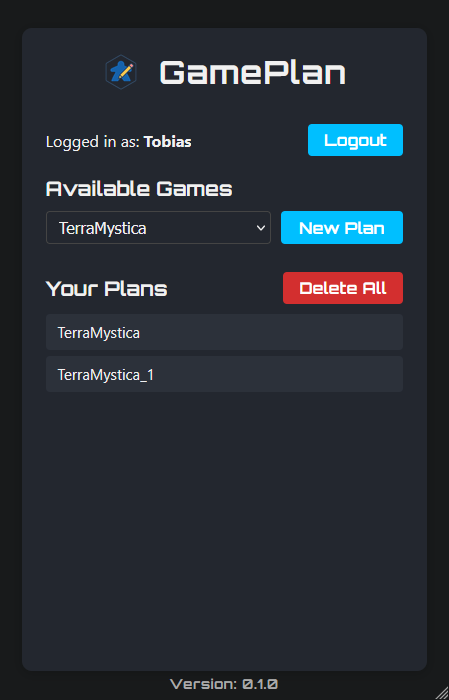
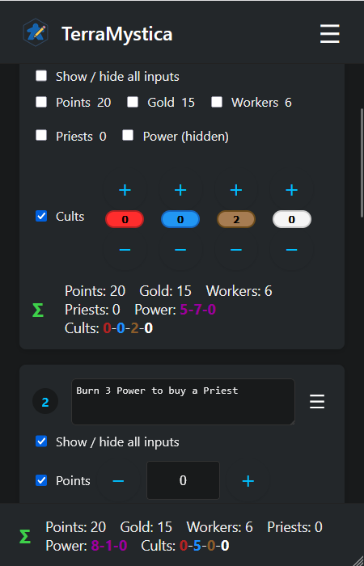
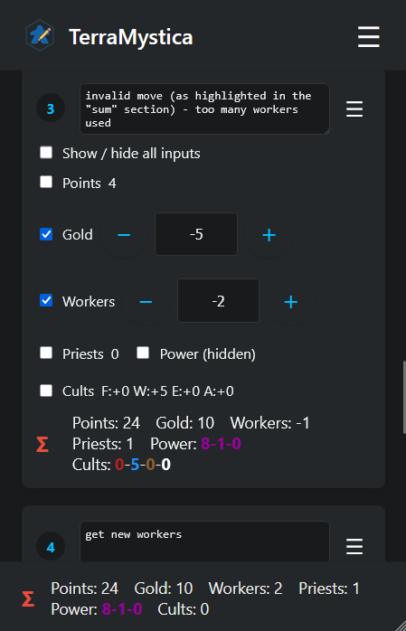
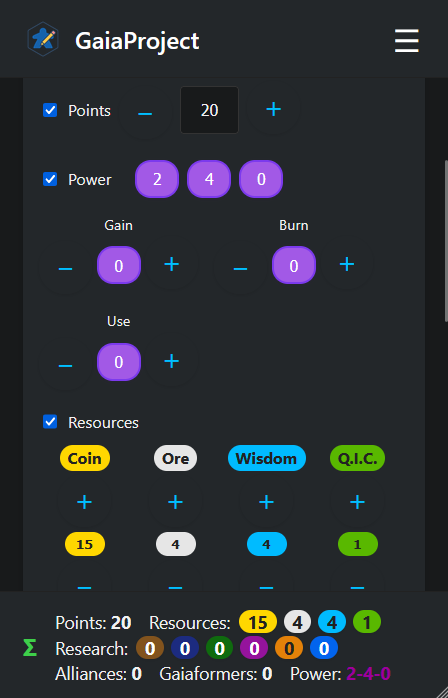
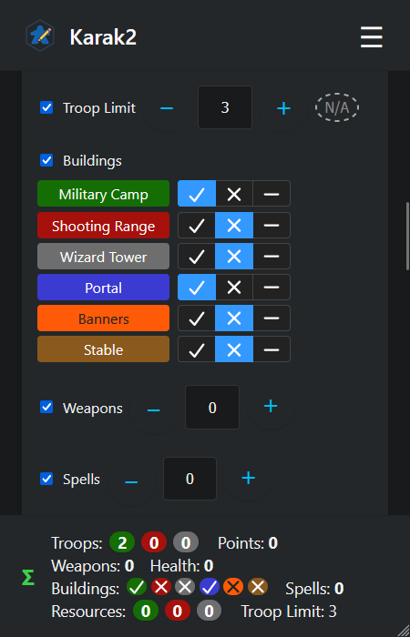

# GamePlan

**GamePlan** is a simple and flexible planning tool to keep track of resources in complex board games like *Terra
Mystica*, *Gaia Project*, *Root*, and many others. It allows players to plan ahead, plan turns, and track resource
changes over time.

> Designed with tabletop gamers in mind, especially for strategic planning in resource-heavy games.

## 📚 Table of Contents

- [Project Status](#-project-status)
- [Planned Features](#-planned-features)
- [Relevant Folders](#-relevant-folders)
- [Design](#-design)
- [Screenshots](#-screenshots)
- [Tech Stack](#-tech-stack)
- [Why GamePlan?](#-why-gameplan)
- [Building and Running Locally](#-building-and-running-locally)
    - [Prerequisites](#prerequisites)
- [Usage](#-usage)
- [License](#-license)
- [Contributions](#-contributions)

## 🚧 Project Status

Version 1.0.0 is available as a first stable release. Some additional features are planned for future releases.

## ✨ Features

### 🔹 Core Features

- Add and remove **turns**, each with:
    - A **comment** or label (free text)
    - Manual **resource changes**
        - Simple inputs for numeric changes
        - Combined inputs with customizable names and colors for simple inputs
        - Absolute inputs for setting values that are not summed up
        - One Time inputs using tri-state buttons to set boolean values
        - Specialized inputs for custom resources (Terra Mystica power cycle or cults)
- Configurable **resources per game** (defined in backend JSON)
- Resource **templates** for predefined starting states
- **Live resource summary** with per-turn and total calculation
- **Warnings** for negative resource totals

### 💾 Persistence

- Save and load plans by **anonymous username** (no login required)
- Support for:
    - **Multiple games per user**
    - **Multiple plans per game**
    - **Copying** a plan (for branching scenarios)
    - **Deleting** plans
- Simple, shareable URLs: \<domain>/app/\<username>/plan/\<plan_id>
- Example: `game-plan.net/app/tobias/plan/terra_mystia_3` → 3rd plan for Tobias’ Terra Mystica game

### 🛠️ Configuration

- Backend uses JSON **config files** for each game
- Each config defines available resources
- No admin UI needed for now—just drop files into a config directory
- Example configs for some games are provided in the [examples/game_configs/](examples/game_configs/) folder

## 🌱 Additional (Future) Features

- **Undo/Redo** for turn/resource edits
- **Constraints** for resource limits (e.g., max 20 money / sum of troops max *\<a variable troop count\>*)

## 📁 Relevant Folders

- [`examples/game_configs/`](examples/game_configs/) — Example game configuration JSON files and templates.
- [`frontend/`](frontend/) — Source code for the React frontend.
- [`src/main/resources/`](src/main/resources/) — Backend resources, including `application.properties`.
- [`scripts/`](scripts/) — Helper scripts to start/stop the server.

## 🧩 Design

GamePlan is **mobile-first** and fully responsive:

- **Top**: Menu bar with game and plan selection
- **Middle**: Scrollable list of turns (inputs can be expanded/collapsed)
- **Bottom**: Current totals

## 🖼️ Screenshots

Below are some example screenshots of GamePlan in action:

<div style="display: flex; gap: 24px; justify-content: center; align-items: flex-start;">
  <figure>
    
  </figure>
  <figure>
    
  </figure>
  <figure>
    
  </figure>
  <figure>
    
  </figure>
  <figure>
    
  </figure>
</div>

## ⚙️ Tech Stack

- **Frontend**: React
- **Backend**: Quarkus (Java)
- **Data**: JSON-based config files and plan storage

## 🧠 Why GamePlan?

Modern board games often demand forward-thinking strategies and careful resource planning. GamePlan gives players a
distraction-free space to simulate and refine their ideas—whether it's to prep for a competitive tournament or just
optimize that next epic engine combo.

## 🏗️ Building and Running Locally

To build the React frontend run the gradle task `buildFrontend` (this should be done before building the quarkus
server):

```bash
./gradlew buildFrontend
```

To start the quarkus server (or build the project into a jar) run:

```bash
./gradlew quarkusDev
```

or

```bash
./gradlew quarkusBuild
java -jar build/quarkus-app/quarkus-run.jar
```

Note: If you don't want to compile the project yourself you can also download the latest release from GitHub. If you
want to run the compiled version go to the directory **quarkus-app** and run the jar file as shown above. For
configuration and usage info see below.

### Prerequisites

You need to have Java 17 or higher installed to run the quarkus server.

## 🕹️ Usage

To get started with GamePlan download the release from GitHub or build the project yourself (see above).

To use GamePlan you first need to configure some properties and add game config files.

1. **Create an `application.properties` file** for the Quarkus server (if not already present). This file should be
   placed in the directory where you put the compiled jars / dirs from the release (if you downloaded it) or from the
   build directory (if you built it manually). In the directory **quarkus-app** create a directory **config** (if not
   already existing) and place the **application.properties** file there.
2. **Configure the path to your working directory** by adding the following property:

   ```properties
   game_plan.path=PATH_TO_YOUR/.game_plan
   ```
   Replace `PATH_TO_YOUR/.game_plan` with the absolute path where you want GamePlan to store user plans and game data.
3. Once the server is started for the first time it will automatically create the working directory (if it does not
   exist yet) and the following subdirectories:
    - `.games`: You need to place your game config JSON files here.
    - `.users`: This directory will contain user data (plans, etc.). You don't need to edit it (only if you want to
      delete user data manually).
4. **Add game config JSON files** to your working directory as needed (see the `examples/game_configs/` folder in the
   GitHub project for
   templates).
5. Restart the quarkus server after you added the game configuration files. You might need to delete some old user data
   if you changed the game config files in a non-compatible way.
6. Access the GamePlan frontend in your browser at `http://localhost:4713` (or the port you configured in the *
   *application.properties** file using the property `quarkus.http.port` - see steps 1 and 2). You should also be able
   to access it from within your local network (using the IP address of your machine or a local DNS name that most
   FritzBox routers have). This way you don't have to run the quarkus app on you mobile phone but can access it from
   there (and you friends can access it too if you want to play together).
7. Enjoy planning your games!

## 📄 application.properties Location Summary

| Scenario               | Location for `application.properties`         | Notes                                                 |
|------------------------|-----------------------------------------------|-------------------------------------------------------|
| **Source Build**       | `src/main/resources/`                         | Used during development/building with Gradle.         |
| **Release/JAR**        | `quarkus-app/config/` (next to the JAR)       | For running the compiled JAR from a release or build. |
| **Custom Config Path** | Specify with `-Dquarkus.config.location=PATH` | Use JVM arg to override config location if needed.    |

This table summarizes where to place your `application.properties` file depending on how you run GamePlan. For most
users, use `src/main/resources/` when developing, and `quarkus-app/config/` when running a release or built JAR. You can
also override the config location using the JVM argument as shown above.

## 📄 License

This project is licensed under the [MIT License](LICENSE).

## 🙌 Contributions

Feedback and contributions are welcome! Whether you're a developer, designer, or gamer, feel free to open issues,
suggest features, or submit pull requests.
